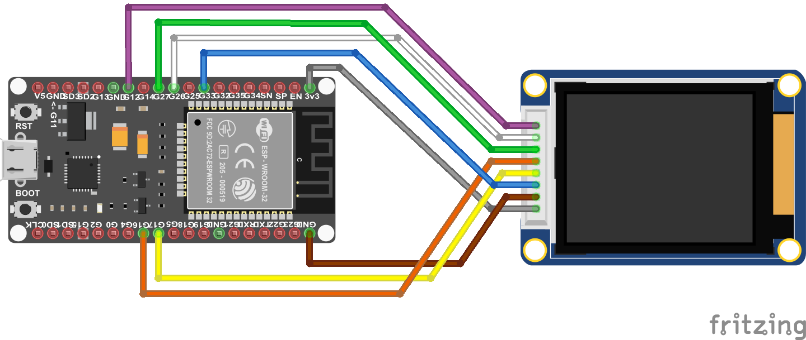
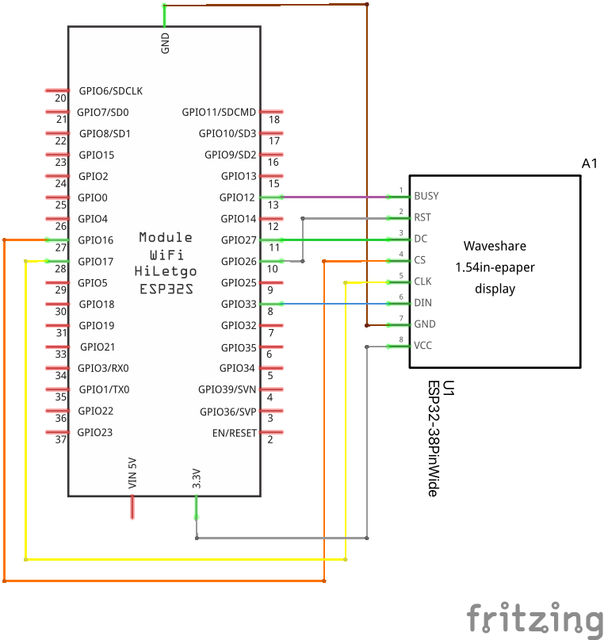

<!--
*** raulgotor, eink-weather-clock, twitter_handle, e-Ink based Weather Clock, WiFi Weather clock, flip-clock style, based on a e-Ink display
-->


<!-- PROJECT SHIELDS -->
<!--
-->
[![Contributors][contributors-shield]][contributors-url]
[![Forks][forks-shield]][forks-url]
[![Stargazers][stars-shield]][stars-url]
[![Issues][issues-shield]][issues-url]
[![MIT License][license-shield]][license-url]

<!-- PROJECT LOGO -->
<h3 align="center">e-Ink based Weather Clock</h3>

  <p align="center">
    WiFi Weather clock, flip-clock style, based on a e-Ink display
    <br />
    <a href="https://github.com/raulgotor/eink-weather-clock"><strong>Explore the docs »</strong></a>
    <br />
    <br />

   
    <br />
    <a href="https://github.com/raulgotor/eink-weather-clock">View Demo</a>
    ·
    <a href="https://github.com/raulgotor/eink-weather-clock/issues">Report Bug</a>
    ·
    <a href="https://github.com/raulgotor/eink-weather-clock/issues">Request Feature</a>
  </p>

<!-- TABLE OF CONTENTS -->
<details open="open">
  <summary><h2 style="display: inline-block">Table of Contents</h2></summary>
  <ol>
    <li>
      <a href="#getting-started">Getting Started</a>
      <ul>
        <li><a href="#prerequisites">Prerequisites</a></li>
        <li><a href="#installation">Installation</a></li>
      </ul>
    </li>
    <li><a href="#usage">Usage</a></li>
    <li><a href="#roadmap">Roadmap</a></li>
    <li><a href="#contributing">Contributing</a></li>
    <li><a href="#license">License</a></li>
    <li><a href="#contact">Contact</a></li>
    <li><a href="#acknowledgements">Acknowledgements</a></li>
  </ol>
</details>


<!-- ABOUT THE PROJECT -->
## About The Project
This project holds the firmware for a nice retro-looking weather internet clock.
The information is displayed in an e-Ink display that contributes to the special
look of the device. The time is displayed in a clear flip-clock style font,
while the current weather is show as simple icons together with explanatory text.

Additional information such as temperature, humidity and pressure is displayed as well.

The device is connected to the internet wirelessly where it retrieves the time
and weather information from.

Basic features are:
- ESP32 based, WiFi connection
- Connectivity handled by WiFi Manager
- Display managed by LVGL
- Waveshare e-ink 2.9" Display
- Time synchronized with World Time API
- Weather obtained from Open Weather Map
- 24h time display
- Weather information: current weather plus temperature, humidity and pressure

### Built With

* ESP-IDF v4.4-dev-3042-g220590d599

<!-- GETTING STARTED -->
## Getting Started

### Hardware Set-up

#### Required components

- [Waveshare e-Paper 2.9inch module](https://www.waveshare.com/product/displays/e-paper/2.9inch-e-paper-module.htm?___SID=U)
- [ESP32 NODEMCU Module](https://www.az-delivery.de/en/products/esp32-developmentboard?_pos=2&_sid=42112ceb9&_ss=r&variant=36542176914) (Or similar, just ensure that dimensions are the same so it can fit on the 3D case)
- 3D printed case, see section below

#### 3D printed case

STL files for 3D printing the clock case are provided. The case is divided in
3 parts for easier printing and assembly. Check `3d` folder in this repo.

#### Assembly

Basically the steps would be:
1. Plug the cable that comes with the display
2. Take the front part of the case, and slide the display in to the slots at the rigth side and screw it at the left side.
3. Clip the middle part of the case to the front part
4. Connect the cables to the ESP32 board according to the wiring diagram below

      
      

      > Note: Display length on the image is reduced

5. Insert the ESP32 board into the slot at the bottom part of the case
6. Close the case by clip the back part with the middle one.
7. Declare it with the macro `LV_IMG_DECLARE(your_asset_name_without_extension)`
8. It is ready to use!

### Firmware Installation

#### Prerequisites

- Install ESP-IDF Framework, follow the walk-through [here](https://docs.espressif.com/projects/esp-idf/en/latest/esp32/get-started/linux-macos-setup.html).
- Register at [openweathermap.org](https://openweathermap.org) and obtain an API key
- 
### Cloning this repository

1. Clone the repo
   ```sh
   git clone https://github.com/raulgotor/eink-weather-clock.git
   ```
   
2. cd into the repo folder and update submodules:
   ```sh
   cd eink-weather-clock && git submodule update --init --recursive
   ```
Before using your clock, you have to configure and build the firmware with specific
information such as your Open Weather Map API key and your location. For that, follow the
following steps

### Firmware configuration

In a terminal, execute

``` idf.py menuconfig```

And then navigate to `Component config / Application configuration`. Once there,
introduce;
- Your **Open Weather Map API key**,
- the **city** where you'd like to have the weather information from,
- the **continent** this city is at
- the **language** (in two characters format) in which you'd like the information to be displayed.
- [Optional] the **refresh interval** of the weather information (defaults to 10 min)

Press `q` to exit, and when asked to save, press `(Y)`.

### Building and flashing the firmware
   
Connect your clock to the computer with the USB cable, and build and flash the firmware:
   ```sh
   idf.py flash
   ```
   
Optionally, you can also specify the port if you know it. For instance, on MacOS:
   ```sh
   idf.py flash -p /dev/tty.SLAB_USBtoUART
   ```
<!-- USAGE EXAMPLES -->
## Usage

Once firmware is flashed, the clock will boot

If a configured network is not available, the device will launch an access point named __eInk-Weather-Clock__. Connect to that
network using the default password __einkweatherclockpwd__ and a captive portal will pop-up (if it doesn't, manually navigate to address `10.10.0.1` at your browser).

In this window, find your WiFi network name, enter your network password and press __Join__. If everything went well, the clock will connect
to it and will display the internet retrieved time.

> Note: the default AP SSID and password can be changed at `menuconfig`, and then navigating to `Component config / WiFi Manager Configuration` and setting the `Access Point SSID` and `Access Point Password` respectively

### Further documentation

#### Converting images to be used by the `gui` module

1. Save your image as PNG with the desired size
2. Go to [image converter](https://lvgl.io/tools/imageconverter) site.
3. There select:
   - `CF_INDEXED_1BIT`
   - C array
4. Generate the asset and put it under `assets` folder
5. Add it as a source at the `CMakeLists.txt` file
6. 
<!-- ROADMAP -->
## Roadmap

See the [open issues](https://github.com/raulgotor/eink-weather-clock/issues) for a list of proposed features (and known issues).


<!-- CONTRIBUTING -->
## Contributing

1. Fork the Project
2. Create your Feature Branch (`git checkout -b feature/AmazingFeature`)
3. Commit your Changes (`git commit -m 'Add some AmazingFeature'`)
4. Push to the Branch (`git push origin feature/AmazingFeature`)
5. Open a Pull Request


<!-- LICENSE -->
## License

Distributed under the MIT License. See `LICENSE` for more information.


<!-- CONTACT -->
## Contact

Raúl Gotor

Project Link: [https://github.com/raulgotor/eink-weather-clock](https://github.com/raulgotor/eink-weather-clock)

<!-- ACKNOWLEDGEMENTS -->
## Acknowledgements

* [LVGL - Light and Versatile Graphics Library](https://lvgl.io)
* [esp32-wifi-manager](https://github.com/tonyp7/esp32-wifi-manager)
* [Embedded C Coding Standard, 2018 Michael Barr](https://barrgroup.com/sites/default/files/barr_c_coding_standard_2018.pdf)
* [Best README template](https://github.com/othneildrew/Best-README-Template)


<!-- MARKDOWN LINKS & IMAGES -->
<!-- https://www.markdownguide.org/basic-syntax/#reference-style-links -->
[contributors-shield]: https://img.shields.io/github/contributors/raulgotor/eink-weather-clock.svg?style=for-the-badge
[contributors-url]: https://github.com/raulgotor/eink-weather-clock/graphs/contributors
[forks-shield]: https://img.shields.io/github/forks/raulgotor/eink-weather-clock.svg?style=for-the-badge
[forks-url]: https://github.com/raulgotor/eink-weather-clock/network/members
[stars-shield]: https://img.shields.io/github/stars/raulgotor/eink-weather-clock.svg?style=for-the-badge
[stars-url]: https://github.com/raulgotor/eink-weather-clock/stargazers
[issues-shield]: https://img.shields.io/github/issues/raulgotor/eink-weather-clock.svg?style=for-the-badge
[issues-url]: https://github.com/raulgotor/eink-weather-clock/issues
[license-shield]: https://img.shields.io/github/license/raulgotor/eink-weather-clock.svg?style=for-the-badge
[license-url]: https://github.com/raulgotor/eink-weather-clock/blob/master/LICENSE.txt
[linkedin-shield]: https://img.shields.io/badge/-LinkedIn-black.svg?style=for-the-badge&logo=linkedin&colorB=555
[linkedin-url]: https://linkedin.com/in/raulgotor
